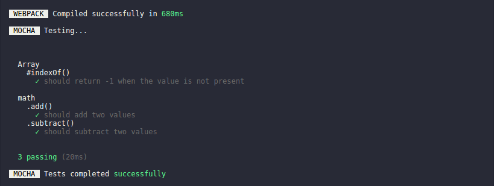
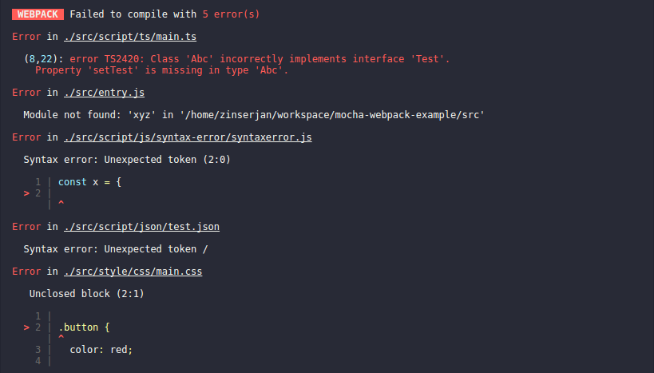

# mocha-webpack [![npm package][npm-badge]][npm]  [![Build Status Linux][build-badge]][build] [![Build Status Windows][build-badge-windows]][build-windows] [![codecov][codecov-badge]][codecov] [![Greenkeeper badge][greenkeeper-badge]][greenkeeper]

> mocha test runner with integrated webpack precompiler

mocha-webpack is basically a wrapper around the following command...
```bash
$ webpack test.js output.js && mocha output.js
```

... but in a much more *powerful* & *optimized* way.



mocha-webpack ...
- precompiles your test files automatically with webpack before executing tests
- handles source-maps automatically for you
- does not write any files to disk
- understands globs & all other stuff as test entries like mocha

Benefits over plain mocha
- has nearly the same CLI as mocha
- you don't rely on hacky solutions to mock all benefits from webpack, like path resolution
- mocha-webpack provides a much better watch mode than mocha

## Watch mode (`--watch`)

Unlike mocha, mocha-webpack analyzes your dependency graph and run only those test files that were affected by this file change.

You'll get continuous feedback whenever you make changes as all tests that are related in any way to this change will be tested again. Isn't that awesome?

If any build errors happens, they will be shown like below



## Which version works with mocha-webpack?

mocha-webpack works with
- webpack in version `4.x.x`
- mocha in version `4.x.x` & `5.x.x`

## Installation

Install mocha-webpack via npm install
```bash
$ npm install webpack mocha mocha-webpack --save-dev
```

and use it via npm scripts in your `package.json`

Further installation and configuration instructions can be found in the [installation chapter](./docs/installation/setup.md).

## Sample commands

run a single test

```bash
mocha-webpack simple.test.js
```

run all tests by glob

```bash
mocha-webpack "test/**/*.js"
```
**Note:** You may noticed the quotes around the glob pattern. That's unfortunately necessary as most terminals will resolve globs automatically.

run all tests in directory "test" matching the file pattern *.test.js  (add `--recursive` to include subdirectories)

```bash
mocha-webpack --glob "*.test.js" test
```

Watch mode? just add `--watch`

```
mocha-webpack --watch test
```

### License

MIT

[build-badge]: https://travis-ci.org/zinserjan/mocha-webpack.svg?branch=master
[build]: https://travis-ci.org/zinserjan/mocha-webpack
[build-badge-windows]: https://ci.appveyor.com/api/projects/status/pnik85hfqesxy7y9/branch/master?svg=true
[build-windows]: https://ci.appveyor.com/project/zinserjan/mocha-webpack
[npm-badge]: https://img.shields.io/npm/v/mocha-webpack.svg?style=flat-square
[npm]: https://www.npmjs.org/package/mocha-webpack
[codecov-badge]:https://codecov.io/gh/zinserjan/mocha-webpack/branch/master/graph/badge.svg
[codecov]: https://codecov.io/gh/zinserjan/mocha-webpack
[greenkeeper]: https://greenkeeper.io/
[greenkeeper-badge]: https://badges.greenkeeper.io/zinserjan/mocha-webpack.svg
