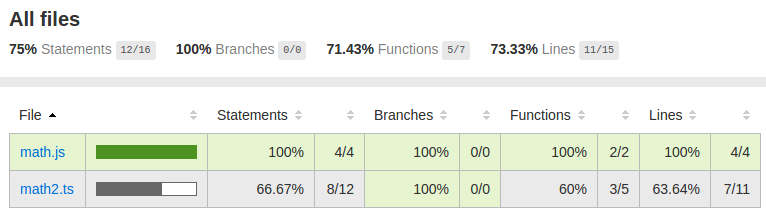
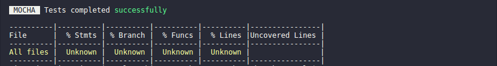
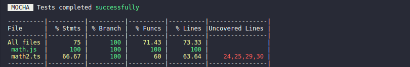

# Code Coverage with mocha-webpack


This guide will show you how to setup code coverage with mocha-webpack and get a report like the following.


  *Yes, this is a very poor sample report for just two files...*

For a generic setup that works with Babel, TypeScript and others, you just need the following tools:
 - `nyc`: CLI for istanbul that collects coverage data & generates coverage reports
 - `istanbul-instrumenter-loader`: Loader that wraps your code with hooks to track coverage when your code get's executed.


First of all we install both with

```bash
$ npm install --save-dev nyc istanbul-instrumenter-loader
```

Then your package.json should contain the installed modules.

**package.json**
```json
{
  ...
  "devDependencies": {
    "cross-env": "^3.1.4",
    ...
    "istanbul-instrumenter-loader": "^1.2.0",
    ...
    "nyc": "^10.0.0",
    ...
  },
  ...
}
```

*Note:* [cross-env](https://github.com/kentcdodds/cross-env) is here also installed, which set environment variables across platforms.

As second step we define a npm script to run our tests with code coverage.

**package.json**
```json
{
  "scripts": {
    "test": "mocha-webpack --watch",
    "test-ci": "mocha-webpack",
    "cover": "cross-env NODE_ENV=coverage nyc --reporter=lcov --reporter=text npm run test-ci"
  },
}

```

This allows us to get coverage reports of our codebase with the command `npm run cover`.

*Note:* mocha-webpack in this sample is preconfigured via the `mocha-webpack.opts` file.

As next we need to configure `nyc` within our package.json:

**package.json**
```json
{
  ...
  "nyc": {
    "include": [
      "src/**/*.js"
    ],
    "instrument": false,
    "sourceMap": false
   },
   ...
}

```

- `include` contains pattern for the location of your source files. Only the files that are listed in this list, are covered.
- `instrument: false` stops nyc from instrumenting your code, that's the task of loader
- `sourceMap: false` is disabled for the same reason like `instrument`

When you start `npm run cover ` now, you get something like this:



Now it's time to setup `istanbul-instrumenter-loader` to get proper code coverage reports. You just need to add `istanbul-instrumenter-loader` to the loaders list in your webpack configuration.


**webpack.config-test.js**
```javascript
var nodeExternals = require('webpack-node-externals');
var isCoverage = process.env.NODE_ENV === 'coverage';

module.exports = {
  output: {
    // use absolute paths in sourcemaps (important for debugging via IDE)
    devtoolModuleFilenameTemplate: '[absolute-resource-path]',
    devtoolFallbackModuleFilenameTemplate: '[absolute-resource-path]?[hash]'
  },
  module: {
    rules: [].concat(
      isCoverage ? {
          test: /\.(js|ts)/,
          include: path.resolve('src'), // instrument only testing sources with Istanbul, after ts-loader runs
          loader: 'istanbul-instrumenter-loader'
      }: [],
      {
          test: /.js$/,
          exclude: /(node_modules|bower_components)/,
          loader: 'babel-loader',
      },
      {
          test: /\.ts$/,
          exclude: /(node_modules|bower_components)/,
          loader: 'ts-loader'
      }
    ),
    // ...
  },
  target: 'node',  // webpack should compile node compatible code
  externals: [nodeExternals()], // in order to ignore all modules in node_modules folder
  devtool: "inline-cheap-module-source-map"
};
```

In this config we add `istanbul-instrumenter-loader` only when we want coverage reports. The loader must be the first entry in the loaders array to ensure that it gets applied as last.
Alternatively you can also use the [`enforce` option](https://webpack.js.org/configuration/module/#rule-enforce).

Another important detail is that the `include` option should be configured in the same way (but webpack compatible) as in the `package.json`. `istanbul-instrumenter-loader` does not respect the value in the package.json, that's why you need to configure it again.

When you run `npm run cover` again you should see something like this - dependent on your code:



And you should get an html report (located at `./coverage/lcov-report/index.html`) that looks like the one from the intro.


## Generate coverage reports for the whole codebase

Only files that were executed within your test run generate code coverage reports. Normally you start your tests with just the test files as entries.

But when you want code coverage reports for the whole codebase, you need to import the rest of the code. It happens very often, that some files doesn't have any tests and doesn't impact the code coverage negatively.

That's not the desired behavour.

Let's assume that we have a directory for source files with name `src` and a folder for tests with name `test` in the project root, like the following:

```
project
  - src
    - module1.js
    - module2.js
  - test
    - module1.test.js
```

As you can see we have two files `module1.js` and `module2.js` in our `src` folder. And more important only `module1.js` has a related unit test file. `module2.js` doesn't have any tests.

When we run our tests now with the following command...

```bash
$ mocha-webpack "test/**/*.js"
```

... `module2.js` will never be executed.

To fix this we add another entry to make sure that all source files are imported:

```bash
$ mocha-webpack "src/**/*.js" "test/**/*.js"
```

**Note:** It's recommended to have a CI configuration that imports all *source* + *test* files and for developing it's best to import only the tests cause importing code that will never execute causes unnecessary compile time.
