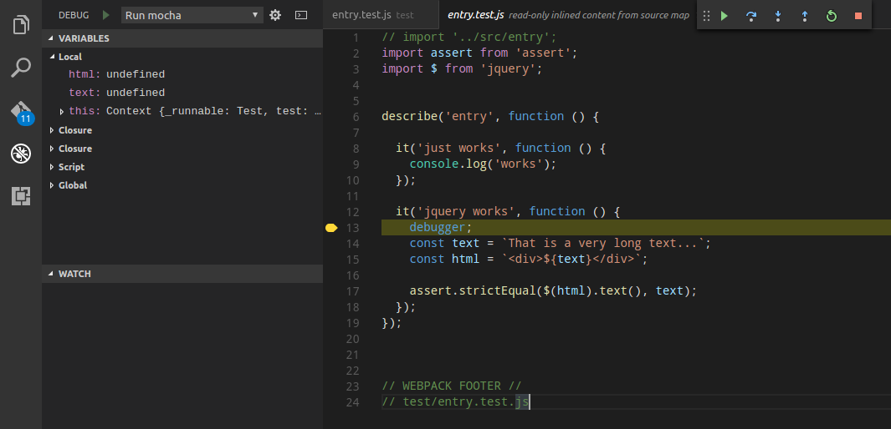

# Using mocha-webpack in IDEs

## Debug in IDEA (WebStorm, IntelliJ, ...)

1. Make sure the `NodeJS` repository plugin is installed and enabled. The plugin is not bundled with every IDEA product, but it can be installed from the JetBrains plugin repository.
1. Create a Testrunner config
  
   - replace `Mocha package` path with path of mocha-webpack (should be a (dev-) dependency of your project)
   - set some additional configuration options (mocha-webpack.opts in this case)
   - specify the tests to run
1. make sure that your webpack config contains the following (important for setting breakpoints in src):

   ``` javascript
   {
     ...

     output: {
         devtoolModuleFilenameTemplate        : '[absolute-resource-path]',
         devtoolFallbackModuleFilenameTemplate: '[absolute-resource-path]?[hash]'
       },

     ...
   }
   ```
1. also you have to use a *non-eval* devtool in your webpack config, e.g.

   ``` javascript
   {
     ...

     devtool: '#inline-cheap-module-source-map',

     ...
   }
   ```
1. start your run configuration in debug mode
1. happy testing
  

**Note:** Debugging in watch mode does not work with IDEA. Therefore you have rerun your debugger whenever you make changes.
It's recommended to specify only a single test file to reduce start-up time.

## Debug in Visual Studio Code

Unfortunately setting breakpoints like in IDEA isn't possible with Visual Studio Code, yet. There is an [open issue](https://github.com/Microsoft/vscode/issues/5728) in the VS Code Repo.

You can workaround this with `debugger;` statements in your code.

1. make sure that you use a *inline* devtool in your webpack config, e.g.

   ``` javascript
   {
     ...

     devtool: '#inline-cheap-module-source-map',

     ...
   }
   ```

1. create a launch.json in your .vscode folder like the following:

  ```json
  {
    "version": "0.2.0",
    "configurations": [
      {
        "name": "Attach Debugger",
        "type": "node",
        "request": "attach",
        "port": 5858,
        "address": "localhost",
        "restart": true,
        "sourceMaps": false,
        "outFiles": [],
        "localRoot": "${workspaceRoot}",
        "remoteRoot": null
      },
      {
        "name": "Run mocha-webpack",
        "type": "node",
        "request": "launch",
        "port": 5858,
        "program": "${workspaceRoot}/node_modules/mocha-webpack/bin/mocha-webpack",
        "stopOnEntry": false,
        "sourceMaps": true,
        "args": [],
        "cwd": "${workspaceRoot}",
        "preLaunchTask": null,
        "runtimeExecutable": null,
        "runtimeArgs": [
          "--debug-brk"
        ],
        "env": { "NODE_ENV": "testing"},
        "console": "internalConsole",
        "outFiles": []
      }
    ]
  }

  ```
1. use `debugger;` statements in your code to set the breakpoints
1. start the debugger with *F5*
1. happy testing
  


